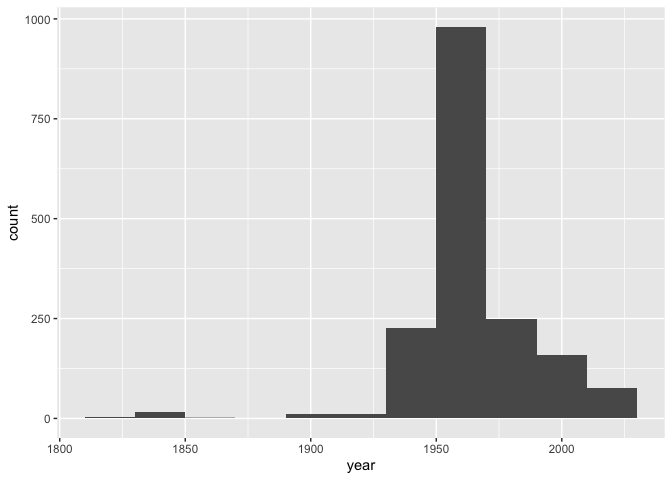

Lab 08 - University of Edinburgh Art Collection
================
Olivia Zhang
03/26/2025

## Load Packages and Data

First, let’s load the necessary packages:

``` r
library(tidyverse) 
library(skimr)
```

Now, load the dataset. If your data isn’t ready yet, you can leave
`eval = FALSE` for now and update it when needed.

``` r
uoe_art <- read_csv("data/uoe-art.csv")
```

## Exercise 9

Let’s start working with the **title** column by separating the title
and the date:

``` r
uoe_art <- uoe_art %>%
  separate(title, into = c("title", "date"), sep = "\\(") %>%
  mutate(year = as.numeric(str_remove(date, "\\)"))) %>%
  select(title, artist, year, link)  
```

    ## Warning: Expected 2 pieces. Additional pieces discarded in 48 rows [15, 160, 173, 232,
    ## 285, 390, 440, 581, 686, 791, 814, 837, 875, 1024, 1110, 1112, 1287, 1494,
    ## 1511, 1518, ...].

    ## Warning: Expected 2 pieces. Missing pieces filled with `NA` in 696 rows [4, 13, 14, 24,
    ## 25, 26, 27, 30, 32, 36, 39, 42, 45, 56, 57, 58, 63, 65, 66, 68, ...].

    ## Warning: There was 1 warning in `mutate()`.
    ## ℹ In argument: `year = as.numeric(str_remove(date, "\\)"))`.
    ## Caused by warning:
    ## ! NAs introduced by coercion

## Exercise 10

The warnings mean that: 1) there are some missing values in the date
column, which is normal, because not all names have dates come after
them; 2) not all things comes after the names in the parentheses is
years or numbers, so as.numeric function doesn’t work for all items in
year. It only work for items that only contains year as numbers without
other strings.

## Exercise 11

``` r
skim(uoe_art)
```

|                                                  |         |
|:-------------------------------------------------|:--------|
| Name                                             | uoe_art |
| Number of rows                                   | 3312    |
| Number of columns                                | 4       |
| \_\_\_\_\_\_\_\_\_\_\_\_\_\_\_\_\_\_\_\_\_\_\_   |         |
| Column type frequency:                           |         |
| character                                        | 3       |
| numeric                                          | 1       |
| \_\_\_\_\_\_\_\_\_\_\_\_\_\_\_\_\_\_\_\_\_\_\_\_ |         |
| Group variables                                  | None    |

Data summary

**Variable type: character**

| skim_variable | n_missing | complete_rate | min | max | empty | n_unique | whitespace |
|:--------------|----------:|--------------:|----:|----:|------:|---------:|-----------:|
| title         |         0 |          1.00 |   0 |  95 |     5 |     1629 |          0 |
| artist        |       111 |          0.97 |   2 |  55 |     0 |     1198 |          0 |
| link          |         0 |          1.00 |  57 |  60 |     0 |     3312 |          0 |

**Variable type: numeric**

| skim_variable | n_missing | complete_rate |    mean |    sd |  p0 |  p25 |  p50 |  p75 | p100 | hist  |
|:--------------|----------:|--------------:|--------:|------:|----:|-----:|-----:|-----:|-----:|:------|
| year          |      1575 |          0.52 | 1964.56 | 53.14 |   2 | 1953 | 1962 | 1977 | 2020 | ▁▁▁▁▇ |

The artist info misses 111 data points, and the year info misses 1575
data points.

## Exercise 12

Make a histogram of years. Use a reasonable bin width. Do you see
anything out of the ordinary?

``` r
uoe_art %>%
  ggplot(aes(x = year)) +
  geom_histogram()
```

    ## `stat_bin()` using `bins = 30`. Pick better value with `binwidth`.

    ## Warning: Removed 1575 rows containing non-finite outside the scale range
    ## (`stat_bin()`).

<!-- -->

There is one outlier that’s closer to 0 that makes the x axis really
stretched out.

## Exercise 13

``` r
#find out the wrong year
table(uoe_art$year)
```

    ## 
    ##    2 1819 1820 1822 1831 1834 1835 1837 1838 1854 1893 1896 1897 1901 1912 1918 
    ##    1    1    1    1    1    1    2   12    1    1    1    1    6    2    3    1 
    ## 1922 1924 1928 1929 1932 1934 1936 1937 1938 1939 1941 1942 1943 1944 1946 1947 
    ##    1    5    1    1    1    2    4    1    2   10    1    1    1    1   24   26 
    ## 1948 1949 1950 1951 1952 1953 1954 1955 1956 1957 1958 1959 1960 1961 1962 1963 
    ##   22   47   84   33   69   66   38   30   30   57   65   82   77   33   71   86 
    ## 1964 1965 1966 1967 1968 1969 1970 1971 1972 1973 1974 1975 1976 1977 1978 1979 
    ##   39   35   37   49   39   37    6    8    8    6   10    7    8    8    4    2 
    ## 1980 1981 1982 1983 1984 1985 1986 1987 1988 1989 1990 1991 1992 1993 1994 1995 
    ##    7   10   10   39   18   10   22   30    6   30    7    7    3    7   11    3 
    ## 1996 1997 1998 1999 2001 2002 2003 2004 2005 2006 2007 2012 2013 2014 2015 2016 
    ##    3   10    5    5    2   23   12    4    3   32   30    2   18   12    9   11 
    ## 2017 2018 2019 2020 
    ##    9    5    5    6

``` r
uoe_art %>% filter(year == 2)
```

    ## # A tibble: 1 × 4
    ##   title         artist        year link                                         
    ##   <chr>         <chr>        <dbl> <chr>                                        
    ## 1 "Death Mask " H. Dempshall     2 https://collections.ed.ac.uk/art/record/2164…

``` r
#correct it 
uoe_art$year <- ifelse(uoe_art$year == 2, 1964, uoe_art$year)
#check
table(uoe_art$year)
```

    ## 
    ## 1819 1820 1822 1831 1834 1835 1837 1838 1854 1893 1896 1897 1901 1912 1918 1922 
    ##    1    1    1    1    1    2   12    1    1    1    1    6    2    3    1    1 
    ## 1924 1928 1929 1932 1934 1936 1937 1938 1939 1941 1942 1943 1944 1946 1947 1948 
    ##    5    1    1    1    2    4    1    2   10    1    1    1    1   24   26   22 
    ## 1949 1950 1951 1952 1953 1954 1955 1956 1957 1958 1959 1960 1961 1962 1963 1964 
    ##   47   84   33   69   66   38   30   30   57   65   82   77   33   71   86   40 
    ## 1965 1966 1967 1968 1969 1970 1971 1972 1973 1974 1975 1976 1977 1978 1979 1980 
    ##   35   37   49   39   37    6    8    8    6   10    7    8    8    4    2    7 
    ## 1981 1982 1983 1984 1985 1986 1987 1988 1989 1990 1991 1992 1993 1994 1995 1996 
    ##   10   10   39   18   10   22   30    6   30    7    7    3    7   11    3    3 
    ## 1997 1998 1999 2001 2002 2003 2004 2005 2006 2007 2012 2013 2014 2015 2016 2017 
    ##   10    5    5    2   23   12    4    3   32   30    2   18   12    9   11    9 
    ## 2018 2019 2020 
    ##    5    5    6

``` r
#plot
uoe_art %>%
  ggplot(aes(x = year)) +
  geom_histogram()
```

    ## `stat_bin()` using `bins = 30`. Pick better value with `binwidth`.

    ## Warning: Removed 1575 rows containing non-finite outside the scale range
    ## (`stat_bin()`).

<!-- -->

The code didn’t capture the correct year information because the
original title was Death Mask (2) (1964), which confused the code to
think that the first number after ( was the year we are looking for.

## Exercise 14

``` r
uoe_art %>% 
  count(artist) %>%
  arrange(desc(n))
```

    ## # A tibble: 1,199 × 2
    ##    artist               n
    ##    <chr>            <int>
    ##  1 Unknown            373
    ##  2 Emma Gillies       175
    ##  3 <NA>               111
    ##  4 Ann F Ward          23
    ##  5 John Bellany        22
    ##  6 Zygmunt Bukowski    21
    ##  7 Boris Bućan         17
    ##  8 Marjorie Wallace    17
    ##  9 Gordon Bryce        16
    ## 10 William Gillon      16
    ## # ℹ 1,189 more rows

The most featured artist is “Unknown.” I’m not sure why the university
has so many pieces from Unknown artists, but I looked up in their
website. They say: ” The early stages of this collecting were closely
linked with galvanising the institution’s identity and status as a place
of learning and inspiration, through the commissioning and collecting of
portraits and busts of Professors and key alumni.” So I guess they may
not know all the artists that created the portraits and busts.

## Exercise 15

Final question! How many art pieces have the word “child” in their
title? See if you can figure it out, and ask for help if not.

Hint: You can use a combination of filter() and str_detect(). You will
want to read the help for str_detect() at a minimum, and consider how
you might capture titles where the word appears as “child” and “Child”.

``` r
child_count <- uoe_art %>%
  filter(
    str_detect(title, regex("child", ignore_case = TRUE))
  ) %>%
  count()
```

There are 11 art pieces have the worl “child” in their title.
